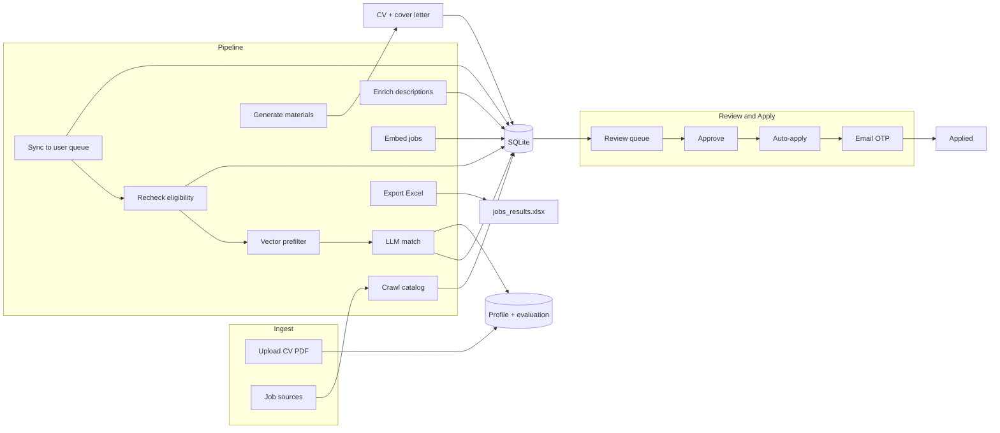

# Job Crawler

An end-to-end job application automation system. It crawls remote job boards into a shared catalog, scores listings against your resume with an LLM-powered ATS matcher, generates tailored CVs and cover letters, and optionally submits applications to Greenhouse and Lever boards via Playwright — including email verification (OTP) handling. CV upload runs through a vendored resume-evaluation agent ([HackerRank's `hiring-agent`](https://github.com/interviewstreet/hiring-agent), MIT-licensed, not authored by this project) to turn a PDF into structured profile data and an initial evaluation.

Two interfaces:

- **CLI** — scripting, batch pipeline runs, and headless automation
- **Web control pane** — FastAPI + HTMX UI for review, settings, and one-click apply

---

## What's been built

Major capabilities implemented in the current codebase:

| Area | Done |
|------|------|
| **Shared catalog** | Platform crawl writes to `catalog_jobs`; each user gets a `user_jobs` overlay via **sync** — crawl once, match per user |
| **Vector pre-filter** | **embed** + **prefilter** stages gate jobs by chunked resume/posting similarity before LLM scoring (`src/matching/prefilter.py`), model-tagged and auto-invalidated on enrichment; `embeddings reset` when switching models |
| **Location eligibility** | Parses country-restricted remote (`Remote - Mexico`, multi-country lists, US/EU-only markers); filters at crawl ingest, LLM match, and pipeline recheck |
| **Eligibility backfill** | After sync, **recheck** skips ineligible jobs already in queue (`recheck-eligibility` CLI + automatic pipeline stage) |
| **ATS crawling** | Adapters for **Ashby**, **Lever**, **Workable**, **SmartRecruiters**, plus Greenhouse, JSON APIs, RSS, target-company boards, and **job-board-aggregator** (Feashliaa chunked dataset) |
| **Enrichment** | Full-description fetch with ATS-specific selectors (Ashby, Workable, SmartRecruiters, Greenhouse, Lever, Remotive) |
| **Target companies** | CRUD at `/targets` + per-user crawl adapter for company career pages |
| **LLM matching** | Structured ATS scores (skills, experience, role fit, gaps, strengths); niche-domain de-emphasis when posting does not mention that domain |
| **Coaching** | Skills gap report, on-demand **profile guide** (CV, GitHub, OSS) with file cache, and **CV draft preview** (generate → HTML/PDF → apply to profile) |
| **Web background tasks** | Pipeline runner with live logs; batch score from Jobs page; per-job score and material generation on job detail |
| **Greenhouse apply** | Full form fill + submit, custom screening questions, OTP detection (`needs_verification`), IMAP auto-fetch, manual code entry, `demo-greenhouse` for headed testing |
| **Multi-user web app** | Registration, OAuth (GitHub/Google), Fernet-encrypted API keys and IMAP passwords, per-user settings and data paths |
| **LLM providers** | Ollama (local), Groq, and Gemini with per-user encrypted keys; model picker + connectivity test in Settings |
| **Onboarding** | Dashboard checklist (CV → keywords → targets → pipeline → first match) |
| **Docker** | `docker-compose.yml` runs the web UI + Ollama side by side |

---

## Features at a glance

| Area | Capabilities |
|------|----------------|
| **Ingest** | 20+ job board adapters (JSON APIs, RSS, Greenhouse, Ashby, Lever, Workable, SmartRecruiters, job-board-aggregator), source discovery, target companies, location filtering at ingest |
| **Profile** | CV PDF → structured resume + GitHub-enriched evaluation via a vendored third-party resume-evaluation agent ([`hiring-agent`](https://github.com/interviewstreet/hiring-agent), see [Credits](#credits)) |
| **Match** | Location eligibility + vector prefilter + LLM ATS scoring (skills, experience, role fit, gaps, strengths) |
| **Generate** | Tailored JSON Resume, PDF/HTML CV, cover letter per job; reusable CV templates |
| **Apply** | Greenhouse & Lever form fill, resume upload, URL fields (LinkedIn, GitHub, portfolio) |
| **Verification** | Greenhouse email OTP — manual entry, IMAP auto-fetch, or headed browser review |
| **Review** | Multi-user auth, dashboard, application tracker, failed-apply retry |
| **Config** | Per-user settings in SQLite; encrypted API keys and IMAP passwords |

---

## How it works



### Pipeline stages

| Stage | Module | What it does |
|-------|--------|--------------|
| **Crawl** | `src/crawler/orchestrator.py` | Fetches jobs from enabled sources in parallel. Deduplicates by URL hash into a shared **catalog**. |
| **Enrich** | `src/enrich.py` | Fetches full job descriptions (Greenhouse, Lever, Remotive, etc.). |
| **Embed** | `src/embeddings.py` | Pre-warms chunked posting vectors for active catalog jobs (skips unchanged ones via a content hash). |
| **Sync** | `src/catalog_db.py` | Copies new catalog listings into each user's job queue. |
| **Recheck** | `src/eligibility_backfill.py` | Re-evaluates location eligibility on existing queue jobs; skips ineligible `new`/`scored`/`queued` rows. |
| **Prefilter** | `src/prefilter.py` (impl in `src/matching/prefilter.py`) | Chunked resume/posting similarity gate before expensive LLM matching. |
| **Match** | `src/matcher.py`, `src/matching/` | Extracts each posting's requirements, retrieves resume evidence per requirement, judges each one, then recomputes scores deterministically. Moves strong matches to `queued`. |
| **Generate** | `src/tailor.py`, `src/cover_letter.py` | Tailored CV + cover letter under `data/applications/<job_id>/`. |
| **Export** | `src/crawler/export.py` | Writes `jobs_results.xlsx`. |

Run everything:

```bash
python cli.py pipeline
```

Or stage by stage: `crawl`, `enrich`, `sync`, `recheck-eligibility`, `prefilter`, `match`, `generate`, `export`.

---

## Job lifecycle

```
new → scored → queued → approved → applied
                  ↓         ↓            ↑
              skipped   failed    needs_verification
                  ↓                      (Greenhouse OTP)
               stale
```

| Status | Meaning |
|--------|---------|
| `new` | In your queue, not yet matched |
| `scored` | Matched but below queue threshold |
| `queued` | Strong match — generate materials |
| `approved` | Human-approved for application |
| `needs_verification` | Greenhouse apply submitted; awaiting email OTP |
| `applied` | Successfully submitted |
| `failed` | Auto-apply failed (retryable) |
| `skipped` | Filtered out (keywords, location, ATS skip) |
| `rejected` | Manually rejected in review |
| `stale` | Not seen in catalog recently |

`application_events` logs status changes, matching, tailoring, apply attempts, and OTP fetch events.

---

## Architecture

### Layer overview

```
cli.py                          # CLI entry point
src/
├── pipeline.py                 # Stage orchestration
├── db.py                       # SQLite persistence (users, jobs, applications)
├── catalog_db.py               # Shared job catalog + embeddings
├── config_store.py             # DB-backed config collections
├── settings.py                 # .env + merged config loading
├── applicant.py                # URL normalization + resume contact merge
├── profile.py                  # CV upload → JSON Resume
├── hiring_agent_bridge.py      # Vendored hiring_agent integration
├── matcher.py                  # Scoring entry point + batch orchestration
├── matching/                   # Retrieval-grounded ATS core
│   ├── requirements.py         # Stage 1: posting → requirements (cached on catalog)
│   ├── chunking.py             # Resume → chunks; posting → requirements section
│   ├── retrieval.py            # Requirement → resume evidence (vector or BM25)
│   ├── judge.py                # Stage 2: per-requirement verdicts + citation checks
│   ├── scoring.py              # Deterministic aggregation of verdicts → scores
│   ├── vectors.py              # Model-tagged vector cache + embedding backends
│   └── engine.py               # MatchContext (per-batch) + grounded_match
├── prefilter.py                # Vector prefilter entry point (impl in matching/prefilter.py)
├── embeddings.py               # Catalog-job chunk-vector pre-warming + embeddings reset
├── ats.py                      # Match result models + queue rules
├── tailor.py                   # Tailored CV generation
├── cover_letter.py             # Cover letter generation
├── llm/                        # Ollama, Groq, Gemini providers
├── enrich.py                   # Full description fetching
├── keywords.py                 # Include/exclude keyword groups
├── eligibility_backfill.py   # Re-check location eligibility on queued jobs
├── scheduler.py                # Optional periodic pipeline runs
├── coaching/                   # Skills gap + profile improvement guide
│   ├── skills_gap.py           # Gap aggregation + LLM report
│   ├── profile_guide.py        # CV/GitHub/OSS guide with file cache
│   └── cv_preview.py           # LLM CV draft from guide tips; apply to profile
├── crawler/
│   ├── orchestrator.py         # Parallel source crawling
│   ├── registry.py             # Adapter factory
│   ├── ats_detect.py           # ATS type from job URL
│   ├── location.py             # Country-restricted remote parsing
│   ├── filters.py              # Location + keyword eligibility
│   └── adapters/               # json_api, rss, greenhouse, ashby, lever, …
├── apply/
│   ├── dispatcher.py           # Apply routing, OTP auto-fetch, retries
│   ├── router.py               # CLI apply entry
│   ├── greenhouse.py           # Playwright Greenhouse adapter + OTP
│   ├── lever.py                # Playwright Lever adapter
│   ├── form_fill.py            # LinkedIn / GitHub / portfolio URL fill
│   ├── otp_mail.py             # IMAP polling for verification codes
│   ├── email.py                # mailto: draft adapter
│   └── playwright_runtime.py   # Shared browser setup
└── web/
    ├── app.py                  # FastAPI application
    ├── auth/                   # Login, register, OAuth (GitHub, Google)
    ├── routes/                 # Dashboard, jobs, pipeline, settings, …
    ├── services/               # Pipeline runner, config, LLM health
    └── templates/              # Jinja2 + HTMX UI
```

### Data model

Jobs live in two layers:

1. **`catalog_jobs`** — shared crawled listings (descriptions, embeddings, source metadata)
2. **`user_jobs`** — per-user queue entries (status, match score, notes) linked to catalog rows

This lets multiple users share one crawl while keeping separate pipelines and application materials.

### Crawler adapters

Sources are stored in the database (`user_sources`). Adapter types:

| Adapter | Use case |
|---------|----------|
| `json_api` | REST APIs (RemoteOK, Remotive, Jobicy, Himalayas, …) |
| `rss` | RSS/Atom feeds |
| `greenhouse` | `boards.greenhouse.io/<company>` boards |
| `lever` | `jobs.lever.co/<company>` boards |
| `ashby` | `jobs.ashbyhq.com/<company>` boards |
| `workable` | Workable-hosted career pages |
| `smartrecruiters` | SmartRecruiters job listings |
| `target_companies` | Per-user target company career pages |
| `job_board_aggregator` | Cross-ATS aggregator microservice |
| `ever_jobs` | External aggregator microservice |
| `legacy` | Hand-written scrapers |

**Source discovery** probes [awesome-job-boards](https://github.com/tramcar/awesome-job-boards) and can auto-register feeds.

### Profile and hiring agent

CV upload uses a vendored copy of [**HackerRank's `hiring-agent`**](https://github.com/interviewstreet/hiring-agent) (`vendor/hiring_agent/`, MIT-licensed — see `vendor/hiring_agent/LICENSE` and `NOTICE.md`). This is third-party code, not written for this project; it's used as-is for:

1. PDF → JSON Resume
2. Optional GitHub enrichment from `basics.profiles`
3. Profile evaluation for matching context

Stored per user under `data/users/<id>/profile/` and in the `profile` table.

### Applicant settings vs resume

**Settings → Applicant** holds contact info used for auto-apply and material generation:

| Field | Used for |
|-------|----------|
| Name, email, phone, location | Form fill + CV header overlay |
| Portfolio / website | `basics.url` on tailored CV + apply forms |
| LinkedIn URL, GitHub URL | `basics.profiles` + apply forms |
| Work authorization, salary | Stored for future form support |

When applicant fields are set, they **override** parsed resume contact/links (`src/applicant.py` → `merge_applicant_into_resume`).

### ATS matching

Scoring runs in two stages (`src/matching/`), selected by `matching.scoring_mode`:

**Stage 1 — extract** (`requirements.py`). The posting is parsed once into structured
requirements: `{id, text, kind: must|nice, category, terms}`, plus the seniority it
targets and the years it asks of the applicant. The result is cached on the shared
`catalog_jobs` row and keyed by a hash of the requirements section, so every user with
that job in their queue reuses it, and an enriched description re-extracts automatically.

**Stage 2 — judge** (`retrieval.py`, `judge.py`). The resume is cut into chunks (one per
role, project, skill group), retrieval surfaces the chunks that bear on each requirement,
and the model returns a per-requirement verdict — `met` / `partial` / `missing` — with the
chunk ids it relied on. A `met` the model cannot tie to a chunk it was actually shown is
downgraded rather than trusted.

**Aggregation** (`scoring.py`) is deterministic — the model never reports a score:

| Component | Max | Derived from |
|-----------|-----|--------------|
| `skill_match` | 40 | weighted requirement coverage (`must` = 1.0, `nice` = 0.4; `met` = 1.0, `partial` = 0.5) |
| `experience_match` | 35 | years asked of the applicant vs merged, gap-excluded career length |
| `role_fit` | 25 | distance between the posting's seniority and `matching.rules.candidate_seniority` |

`overall_score` is the sum of the three, always. `strengths`, `gaps` and `tailoring_hints`
are derived from the verdicts, so every line traces back to a requirement and the resume
chunk that answered it. Results carry `coverage`, `retrieval` (`vector`/`lexical`), `model`
and `prompt_version` so scores stay comparable across runs.

**Retrieval backends.** Vector retrieval is used when the tenant's provider exposes
embeddings (Ollama, Gemini); otherwise a BM25 index over the same chunks is used and the
result records a warning. Vectors live in `vector_store`, tagged with `(model, dim,
text_hash)` — changing the embedding model or the underlying text is a cache miss, so
stale vectors are never silently compared across model spaces.

**Degradation.** Missing model → bullet-heuristic requirement extraction; judging failure →
retrieval-only verdicts; embedding failure → lexical retrieval. Each path is recorded in
`warnings` instead of failing open. Repeated scoring failures increment `match_attempts`
and retire the job after `matching.max_match_attempts` (default 3) rather than retrying
forever.

**Legacy engines.** `scoring_mode` also accepts `llm` (single-shot scoring via
`prompts/job_match_*.jinja`), `rules` (`src/rule_engine.py`), and `hybrid`.

**Pre-LLM filters:** keyword relevance, location eligibility, vector prefilter.

**Vector prefilter** (`src/matching/prefilter.py`) runs before requirement extraction, so
it has to stay LLM-free. It chunks the resume the same way the grounded matcher does and
splits the posting into short spans with a bullet/sentence heuristic
(`chunking.chunk_posting`, no LLM), then scores a job as the mean best-chunk similarity
between the two (via the same `Retriever` + model-tagged `vector_store` cache). Posting
chunk vectors are cached per catalog job, not per user, so the embedding cost is shared
across every user's queue the same way requirement extraction is. The `embed` pipeline
stage pre-warms this cache and skips a job whose posting text hasn't changed since it was
last embedded (`catalog_jobs.embed_content_hash`), so a job first embedded from a
crawl-time snippet is automatically re-embedded once `enrich` fills in its full
description — the old whole-document cosine had no such check and could compare a stale,
truncated vector indefinitely.

**Queue rules** (`src/ats.py`): threshold, role-fit minimum, `maybe` boost.

**Niche-domain handling:** when a posting does not mention a niche domain (e.g. Islamic finance), resume phrasing is softened during match/tailor so general roles are not penalized for unrelated domain experience. Niche-term matching is word-boundary anchored (`islamic finance` will not match inside an unrelated word), not a plain substring check.

### Material generation

- **Tailored CV** — LLM reorders/emphasizes experience; applicant contact merged before and after; outputs JSON, PDF, HTML
- **Cover letter** — uses merged resume context; respects `max_words` and `tone`
- Archives prior versions to `data/applications/<id>/history/<timestamp>/`

### Auto-apply

| Method | Detection | Behavior |
|--------|-----------|----------|
| `greenhouse` | `greenhouse.io`, `grnh.se`, `gh_jid=` | Fill form (incl. custom screening questions), upload CV, submit, handle OTP |
| `lever` | `jobs.lever.co` | Fill form + upload CV (review screenshot) |
| `email` | `mailto:` links | Draft email with attachments |
| `generic` | Everything else | Manual only |

**Greenhouse email verification flow:**

1. Apply fills form and clicks Submit
2. If OTP required → status `needs_verification`, browser session saved
3. Complete via:
   - **Manual** — enter code on job detail page
   - **IMAP auto-fetch** — poll inbox (Settings → Auto-apply)
   - **Fetch code** button — on-demand IMAP poll

**Safety limits:**

- Daily cap (`max_applications_per_day`, default 5)
- Source allowlist (`greenhouse`, `lever`, `email`, `generic`)
- Requires tailored CV on disk
- Auto-apply on approve is **off by default**
- Headless browser toggle in settings (uncheck to watch apply in a visible browser)

```bash
playwright install chromium
```

---

## Web control pane

```bash
python cli.py review serve
# → http://127.0.0.1:8080
```

Register or log in (email/password or OAuth). Each user gets isolated jobs, profile, settings, and credentials.

| Page | Purpose |
|------|---------|
| **Dashboard** | Onboarding checklist, pipeline health, review queue, failed applications |
| **Pipeline** | Run stages in background with live logs |
| **Jobs** | Browse listings with ATS match details; batch score new jobs; per-job score and generate from detail page |
| **Applications** | Active and historical applications |
| **Profile** | Upload CV, view evaluation |
| **Sources** | Enable/disable crawl sources |
| **Targets** | Track target company career pages |
| **Settings** | Account, models, keywords, applicant, auto-apply, integrations |
| **Coaching** | Skills gap report, profile guide (CV/GitHub/OSS), CV draft preview (generate HTML/PDF, apply to profile) |

### Coaching page

Three sections on `/coaching`:

1. **Skill gaps** — frequency chart and LLM summary from your top matches (learning paths, roles unlocked)
2. **Profile guide** — on-demand LLM guide with three cards:
   - **Improve your CV** — actionable resume tips tied to your evaluation
   - **Improve your GitHub** — profile README, pinned repos, contribution activity
   - **Open source to explore** — real OSS projects matched to your stack, with a concrete first step

   Generated via HTMX (**Generate profile guide**), cached at `data/users/<id>/profile/guide.json`, and invalidated when your CV or skill gaps change. CLI: `python cli.py coaching profile-guide`.

3. **CV draft preview** — after the profile guide exists, **Generate CV preview** produces an LLM-edited resume draft from the CV tips. Preview HTML/PDF inline, then **Apply to profile** to replace your stored resume (prior PDF archived). Draft cached at `data/users/<id>/profile/cv_draft.json`; invalidated when the guide cache key changes.

### CV Template Studio

Manage reusable CV layouts at `/templates`:

- **Built-in presets** — Classic (original layout), Compact, and Modern ship for every user
- **Default template** — pick which layout all new tailored CVs use
- **Editor** — adjust fonts, colors, spacing, section visibility, and skills style with live preview
- **Duplicate** — copy a built-in or custom template to customize without losing the original
- **Per-job override** — on the job detail page, choose a template and **Re-render CV** without re-running the LLM

Templates compile from JSON presets into Jinja HTML and render through WeasyPrint (same pipeline as before). Tailoring still edits JSON Resume content only; templates control presentation.

### Settings tabs

| Tab | Contents |
|-----|----------|
| **Account** | Email, OAuth links (GitHub, Google) |
| **Hiring agent** | Run profile evaluation on CV upload |
| **Models** | LLM provider, API keys, Ollama host |
| **Pipeline** | Match thresholds, batch limits, delays |
| **Keywords** | Include/exclude groups for crawl and match |
| **Applicant** | Contact info, portfolio, LinkedIn, GitHub URLs |
| **Auto-apply** | Enable on approve, daily cap, headless, IMAP OTP fetch |
| **Cover letter** | Max words, tone |
| **Integrations** | Ever Jobs, scheduler, source discovery |

---

## Data layout

```
data/
├── jobs.db                     # SQLite (catalog, users, jobs, config)
├── users/<user_id>/
│   ├── profile/
│   │   ├── source_cv.pdf
│   │   ├── resume.json
│   │   ├── guide.json              # Cached profile improvement guide
│   │   └── cv_draft.json           # Cached CV preview draft
│   ├── templates/<slug>/           # Compiled CV template HTML per user
│   │   └── template.html.jinja
│   └── applications/<job_id>/
│       ├── cv_tailored.json
│       ├── cv_tailored.pdf
│       ├── cv_tailored.html
│       ├── cover_letter.md
│       ├── apply_screenshot.png
│       ├── apply_session.json      # OTP / browser session
│       ├── browser_state.json
│       └── history/
├── profile/                      # Legacy single-user paths (CLI bootstrap)
└── applications/

config/
└── sources.yaml.imported         # Migrated on first run

prompts/                          # LLM Jinja2 templates
templates/
├── resume.html                   # Legacy single-template fallback
└── cv/_partials/                 # Section partials for template compiler
.env                              # Platform secrets only
```

### Key database tables

| Table | Purpose |
|-------|---------|
| `catalog_jobs` | Shared crawled listings + embeddings |
| `user_jobs` | Per-user status, scores, notes |
| `applications` | Tailored materials and apply results |
| `profile` | Resume JSON, GitHub data, evaluation |
| `users`, `oauth_accounts` | Authentication |
| `config_collections` | Pipeline, keywords, applicant, auto_apply, … |
| `user_sources` | Job board definitions |
| `target_companies` | Per-user company career pages to crawl |
| `user_llm_credentials` | Encrypted Groq/Gemini API keys |
| `user_imap_credentials` | Encrypted IMAP app password (OTP fetch) |
| `application_events` | Audit log |

---

## Configuration

Runtime settings live in **SQLite collections**, not YAML. On first startup, `config.yaml` and `config/sources.yaml` are imported and renamed to `*.yaml.imported`.

### Environment variables (`.env`)

Platform secrets only:

| Variable | Purpose |
|----------|---------|
| `SESSION_SECRET` | Web session signing |
| `CREDENTIALS_ENCRYPTION_KEY` | Fernet encryption for API keys and IMAP passwords |
| `GITHUB_CLIENT_ID/SECRET`, `GOOGLE_CLIENT_ID/SECRET` | OAuth login |
| `OAUTH_REDIRECT_BASE`, `APP_BASE_URL` | Auth callbacks |
| `SMTP_*` | Password reset emails |

Per-user models, applicant info, and API keys are in the database via Settings.

### LLM providers

| Provider | Auth | Notes |
|----------|------|-------|
| **ollama** | Host URL | Local; lists installed models |
| **groq** | Per-user encrypted API key | Fast cloud inference |
| **gemini** | Per-user encrypted API key | Google Gemini |

### Important settings

| Setting | Default | Description |
|---------|---------|-------------|
| `pipeline.match_threshold` | 70 | Min ATS score to queue |
| `pipeline.role_fit_min` | 15 | Min role-fit subscore |
| `matching.vector_prefilter_enabled` | true | Skip low-similarity jobs before LLM |
| `auto_apply.enabled` | false | Submit on approve without manual click |
| `auto_apply.max_per_day` | 5 | Daily apply cap |
| `auto_apply.headless` | true | Headless Playwright |
| `auto_apply.otp_auto_fetch` | false | Poll IMAP for Greenhouse OTP |
| `auto_apply.otp_imap.*` | Gmail defaults | IMAP host, port, poll timing |
| `models.quality` | gemma3:4b | Model for match, tailor, cover letter |
| `matching.embedding_model` | mxbai-embed-large | Embedding model for the vector prefilter and requirement/resume-chunk retrieval |
| `matching.embedding_provider` | auto | Embedding backend; `auto` follows `llm_provider`, or pin `ollama`/`gemini` explicitly |

### IMAP setup (Greenhouse OTP)

1. Settings → **Auto-apply** → enable **Auto-fetch verification codes**
2. Set IMAP host (`imap.gmail.com:993`), username (defaults to applicant email)
3. Use a Gmail **App Password** (2FA required)
4. **Test inbox connection**, then Save

---

## Setup

### Prerequisites

- Python 3.12+
- [Ollama](https://ollama.com/) with models pulled (or Groq/Gemini API keys)
  - Quality model for match/tailor (e.g. `gemma3:4b`)
  - Embedding model for prefilter: `ollama pull mxbai-embed-large`
- Chromium via Playwright (for auto-apply)

### Install

```bash
python -m venv .venv
source .venv/bin/activate
pip install -r requirements.txt
playwright install chromium   # only if auto-applying
cp .env.example .env
```

### Docker (optional)

Runs the web UI and Ollama together:

```bash
cp .env.example .env   # set SESSION_SECRET
docker compose up --build
# → http://127.0.0.1:8080
```

Pull models inside the Ollama container after first start:

```bash
docker compose exec ollama ollama pull gemma3:4b
docker compose exec ollama ollama pull mxbai-embed-large
```

### First run

```bash
# 1. Start the web UI and register
python cli.py review serve

# 2. Upload CV on Profile page (or CLI):
python cli.py upload-cv path/to/resume.pdf

# 3. Fill Settings → Applicant (email, URLs) and Keywords

# 4. Run pipeline (UI Pipeline page or CLI):
python cli.py pipeline

# 5. Review queued jobs, generate materials, apply
```

Re-import YAML config if needed:

```bash
python cli.py config import-yaml
```

### Switching embedding models

When changing `matching.embedding_model` (e.g. from `nomic-embed-text` to `mxbai-embed-large`), clear old vectors and re-embed:

```bash
ollama pull mxbai-embed-large
python cli.py embeddings reset
python cli.py pipeline
```

If too many good jobs are skipped after the switch, lower `matching.vector_min_score` and `matching.vector_llm_min_score`, then tune from observed scores.

---

## CLI reference

| Command | Description |
|---------|-------------|
| `upload-cv <pdf>` | Parse resume → JSON Resume + evaluation |
| `evaluate-profile` | Re-run profile evaluation |
| `crawl` | Fetch jobs into catalog |
| `enrich` | Fetch full descriptions |
| `sync` | Sync catalog to your queue |
| `recheck-eligibility [--limit N]` | Skip ineligible jobs by location (also runs automatically after sync in pipeline) |
| `prefilter` | Vector pre-filter |
| `embeddings reset` | Clear stored embeddings after switching embedding models |
| `match [--limit N] [--all]` | Score new jobs |
| `generate` | Tailor CV + cover letter for queued jobs |
| `pipeline` | Full pipeline run |
| `export` | Write Excel |
| `sources` | List enabled sources |
| `discover [--limit N]` | Probe awesome-job-boards |
| `review serve` | Start web UI |
| `review list` | Print queued jobs |
| `review approve\|reject\|skip <id>` | Change job status |
| `apply <id> [--force]` | Submit one application |
| `apply <id> --headed` | Apply with visible browser (overrides headless setting) |
| `demo-greenhouse <id>` | Fill Greenhouse form in a visible browser without submitting |
| `retry [<id>] [--all]` | Retry failed applications |
| `coaching report` | Skills gap report |
| `coaching profile-guide` | Profile improvement guide (CV, GitHub, OSS) |
| `config import-yaml` | Import YAML into database |

### Scheduled runs

```bash
python -m src.scheduler
```

Enable via Settings → Integrations (`scheduler.enabled`, default 8h interval).

---

## Testing

```bash
python -m pytest tests/
```

Covers ATS detection and adapters, applicant URL merge, auth, config/secrets encryption, location eligibility, vector prefilter/embedding reset, job-board-aggregator adapter, OTP email parsing, profile guide and CV preview cache, niche-domain matching, skills gap, tailor logic, and Greenhouse apply helpers.

---

## Design principles

- **Config-driven sources** — add boards without Python changes
- **Shared catalog, per-user queues** — efficient multi-user crawling
- **Conservative auto-apply** — off by default, caps, allowlist, approval gate
- **Local-first LLM** — Ollama keeps data on your machine
- **Human-in-the-loop OTP** — automated where possible, manual fallback always available
- **Audit trail** — events + versioned materials for debugging failed applies

---

## Credits

Resume parsing and initial profile evaluation (`vendor/hiring_agent/`) is a vendored,
unmodified-in-spirit copy of [**HackerRank's `hiring-agent`**](https://github.com/interviewstreet/hiring-agent),
used under its MIT license (see `vendor/hiring_agent/LICENSE`). It is third-party
work, included here as-is to power CV upload — not original work of this project.
